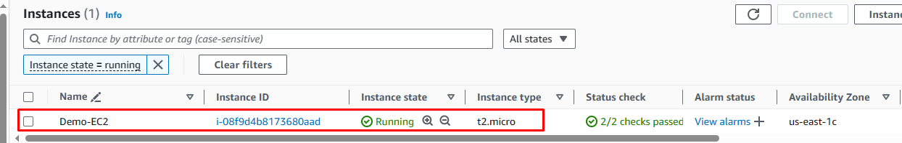

# Provision and setup AWS EC2 instance

## Description

This demo will:

- Use the terraform S3 backend deployed from [tf-backend](../tf-backend/)
- Provision an EC2 intance
- Get the SSH private key from `terraform output` and save to `~/.ssh/...` to access the EC2 via SSH in the next step
- SSH to the newly provisioned EC2 instance and run `remote` script to setup neccessary tool on the remote EC2 machine

## Prepare

## Prepare

### 1-Checkout code:

```bash
git clone https://github.com/TheDevOpsHub/TerraformHub.git
```

### 2-Customize backend configuration

Update the S3 and DynamoDB naming variable:

- Open [TerraformHub/AWS/provision-ec2-instance/backend.tf](./backend.tf) file then change `bucket` and `dynamodb_table` to your own value

```terraform
terraform {
  backend "s3" {
    # Replace this with your S3 bucket name!
    bucket = "your-backend-bucket-name"
    key    = "aws/ec2-demo-terraform.tfstate"
    region = "us-east-1"
    # Replace this with your DynamoDB table name!
    dynamodb_table = "your-backend-table-name"
    encrypt        = true
  }
}
```

### 3. Customize the variables

- Open [TerraformHub/AWS/provision-ec2-instance/variables.tf](./variables.tf) file, then change the variables to your own value if needed

```terraform
variable "agent_tag_name" {
  description = "The tag name of your EC2 instance"
  type        = string
  default     = "Demo-EC2" # Replace by yours if needed
}
variable "security_group_name_for_ec2" {
  description = "The tag name of your EC2 instance"
  type        = string
  default     = "New-Demo-SG-EC2" # Replace by yours if needed
}
variable "ssh_key_name_for_ec2" {
  description = "SSH Key name"
  type        = string
  default     = "ssh-Key-EC2" # Replace by yours if needed
}
```

## Deploy

Run

```bash
cd scripts
./provision_n_setup_ec2.sh
```

At the end of the script you could find the SSH instruction to access your EC2 VM, similar to:

```bash
#...
Setup completed!

Public IP:
x.x.x.x

SSH Key location:
~/.ssh/demo_ec2_key

Now you can run following command to SSH to the EC2 instance:
ssh -o StrictHostKeyChecking=no -i ~/.ssh/demo_ec2_key ubuntu@x.x.x.x
```

## Result

- Visit https://aws.amazon.com/console/ to check your EC2 instance
- SSH to your instance and run some command if needed
- The result woul look like:



## Cleanup

Run

```bash
cd scripts
./cleanup_vm.sh
```
